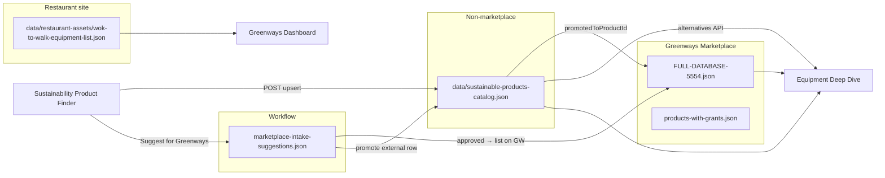

# Sustainable products data model (three catalog layers)

**Updated:** May 2026

This document describes how **Greenways Marketplace (ETL)**, **non-marketplace sustainable products**, and **venue-specific restaurant equipment** relate on the same dashboard and in equipment intelligence / deep dive / finders.

---

## The three layers (plus workflow queue)

| Layer | ID prefix | Canonical file | Purpose |
|-------|-----------|----------------|---------|
| **Greenways Marketplace** | `etl_*` | `FULL-DATABASE-5554.json` + `products-with-grants*.json` | ETL-listed products on the marketplace; grants via `product-grants-integrator.js` + `schemes.json` |
| **Non-marketplace sustainable** | `sust_*` | `data/sustainable-products-catalog.json` | Gas savers, water savers, retrofits, external OEM lines — **auto-upserted on each finder run** (`?persistCatalog=1`) and reused in decision matrix |
| **Venue / owner equipment** | `wok-*`, site slugs | `data/restaurant-assets/*.json` | What is actually on site (e.g. Wok To Walk inventory); powers dashboard Equipment tab |
| **Intake queue** (workflow) | `intake_*` | `data/marketplace-intake-suggestions.json` | “Suggest for Greenways” submissions until approved / listed |

**Benchmark reference (not a product catalogue):** `data/equipment-intelligence-seed.json` — manufacturer specs and typical kWh/L bands for compare/search, not buyable SKUs.

---

## Relationships (how rows link)



- **`promotedToProductId`** on a `sust_*` row keeps history when a product moves onto the marketplace (`marketplaceStatus`: `external` → `listed`).
- **`catalogId`** on an intake suggestion (optional) points back to the sustainable row that was suggested.
- Venue assets can later gain **`suggestedCatalogId`** / **`matchedCatalogId`** when you wire site inventory to catalogue rows (future).

---

## Non-marketplace catalog schema (`sust_*`)

File: **`data/sustainable-products-catalog.json`**

Key fields:

| Field | Role |
|-------|------|
| `utilityProfile` | `dailyKwh`, `dailyWaterLitres`, `dailyGasKwh` — used by `/api/equipment-intelligence/alternatives` for savings vs baseline |
| `impactFactors` | Optional `gasReductionPct` / `waterReductionPct` for wok retrofit modelling (deep dive decision matrix) |
| `specs` | Technical facts from “stats checker” (loads, flow rates, refrigerant, etc.) |
| `sustainability` | Benefits, certifications, narrative for UI |
| `search.keywords` / `search.profiles` | Matching in finder + alternatives API |
| `grants[]` | Filled by grant checker script (scheme-backed, same loader as marketplace) |
| `enrichment.statsStatus` | `verified` \| `estimated` \| `pending` |
| `enrichment.grantsStatus` | `matched` \| `none` \| `pending` |

---

## Checkers (your two pipelines)

### 1. Stats / sustainability checker

- **Today:** Manual or finder-derived rows written to `sustainable-products-catalog.json` (`enrichment.statsSource`: `supplier_spec_sheet`, `water_saving_finder`, `deep_dive_model`, etc.).
- **Next:** Optional script `scripts/enrich-sustainable-products-stats.js` (not yet built) to normalise supplier PDFs / URLs into `specs` + `utilityProfile`.
- **Venue compare:** `equipment-intelligence-seed.json` remains the benchmark library for “actual vs typical”.

### 2. Grant checker

```bash
npm run enrich:sustainable-products
# or: node scripts/enrich-sustainable-products-grants.js nl
```

Uses **`combined-grants-loader.js`** + **`schemes.json`** (same source as `product-grants-integrator.js`). Extend category mapping in the loader if gas/water retrofit categories need more NL/EU scheme hits.

---

## API (runtime)

| Endpoint | Method | Purpose |
|----------|--------|---------|
| `/api/equipment-intelligence/alternatives` | GET | Marketplace + **external** lanes (external = sustainable catalog) |
| `/api/equipment-intelligence/sustainable-products` | GET | List full non-marketplace catalog |
| `/api/equipment-intelligence/sustainable-products` | POST | Upsert row from Sustainability Product Finder (avoid duplicate search) |
| `/api/equipment-intelligence/marketplace-intake-suggestions` | POST | “Suggest for Greenways” queue |

Service: **`services/sustainable-products-catalog.js`**  
Consumer: **`services/equipment-intelligence-service.js`** (`loadExternalAlternatives()`).

---

## UI surfaces

| UI | Marketplace lane | External lane |
|----|------------------|---------------|
| `restaurant-equipment-deep-dive.html` | On Greenways Marketplace | Not Yet on Greenways |
| `sustainable_product_deal_finder_portal.html` | Same API | Same API |
| `water-saving-finder.html` | Water-related ETL | Water `sust_*` rows |
| `Greenways Interface .html` Equipment | Deep dive links | Restaurant detail + alternatives |

**Note:** Wok gas-saver cards were previously hardcoded in deep dive (`getWokAccessoryAlternatives()`). They now live in the catalog as `sust_wok_*`; the API returns them when the profile matches `wok`. You can retire the hardcoded list once you confirm parity in UI.

---

## Recommended workflow

1. **Finder discovers** a product → `POST /api/equipment-intelligence/sustainable-products` (or edit JSON + commit).
2. Run **`npm run enrich:sustainable-products`** after category/type changes.
3. Product appears in **deep dive / finder** external column automatically.
4. User clicks **Suggest for Greenways** → `marketplace-intake-suggestions.json`.
5. On listing → create `etl_*` product, set `promotedToProductId` on the `sust_*` row, set `marketplaceStatus: "listed"`.

---

## What we had before (gap this closes)

- External alternatives were **hardcoded** in `equipment-intelligence-service.js` (5 items only).
- Wok accessories were **hardcoded** in `restaurant-equipment-deep-dive.html` (4 items).
- Intake queue existed but was **not** a product database.
- No single file to grow gas/water/retrofit catalogue for reuse across finders.

**Now:** `data/sustainable-products-catalog.json` is the single growing source for non-marketplace products, with grant enrichment and API upsert aligned to your comparison UI.
